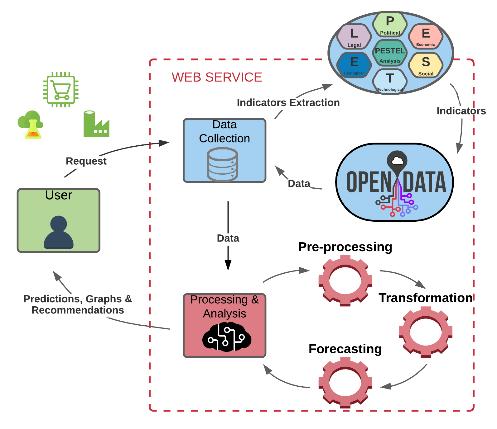
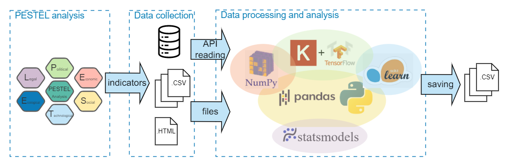
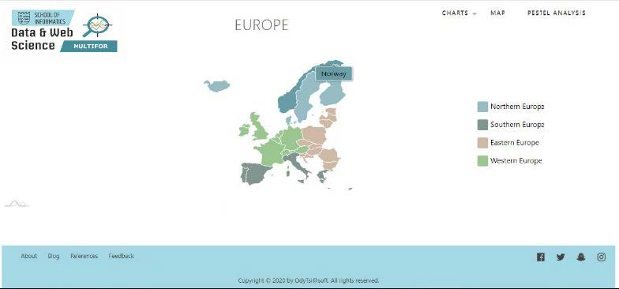
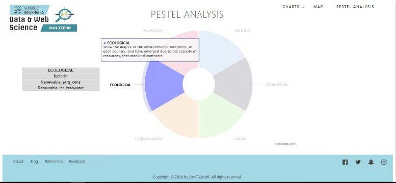
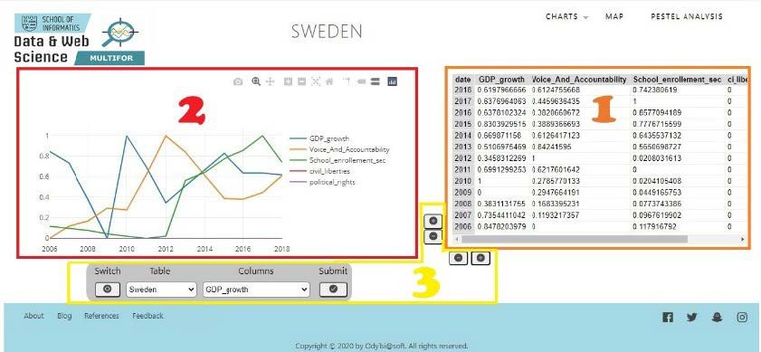

# MULTIFOR: A Multidisciplinary Framework for the identification of new target markets by open time-series data and deep learning methods

|  |
| :----------------------------------------------------------------------------------------------------------: |
|                               <b>Fig.1 - MULTIFOR framework abstract view</b>                                |

## Framework

MULTIFOR framework principles, are the following:

- Robust PESTEL analysis, as a means of selecting the
  appropriate indicators (features) that are necessary to carry
  out the Business Internationalization,
- A set of predefined indicators for European countries
- Open data exploitation.
- Implementation of a LSTM RNN approach,
- Non-stationary time-series forecasting.

## The MULTIFOR Web service architecture

|  |
| :-------------------------------------------------------------------------------------------------: |
|                                 <b>Fig.2 - MULTIFOR Web Service</b>                                 |

The MULTIFOR Web app, as demonstrated in Figure’s 3 site-map, consists of the three following pages:

|  |
| :-----------------------------------------------------------------------------------: |
|                                <b>Fig.3 - Site-map</b>                                |

- **Map Page**, which is the home page, and contains an interactive map of the European countries included in the project, as illustrated in the screenshot of Figure 4.

|  |
| :----------------------------------------------------------: |
|                   <b>Fig.4 - Map page</b>                    |

- **PESTEL Analysis page**, which contains an interactive pie chart with the PESTEL analysis headers, revealing their included indicators in a list whenever hovered, as displayed in Figure 5.
  |  |
  | :-----------------------------------------------------------------------------------: |
  | <b>Fig.5 - PESTEL-Analysis page</b> |
- **Charts Page**, a screenshot of which is depicted in Figure 6, contains the main functionality, developed for the main interaction with the user for time-series analysis, compare and forecasting.
  |  |
  | :-----------------------------------------------------------------------------------: |
  | <b>Fig.6 - Chart page</b> |
